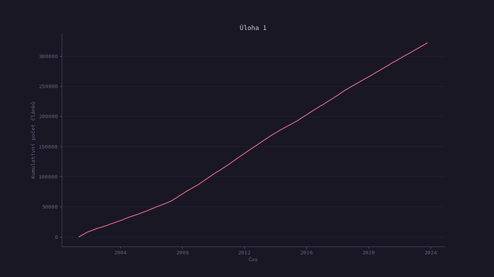
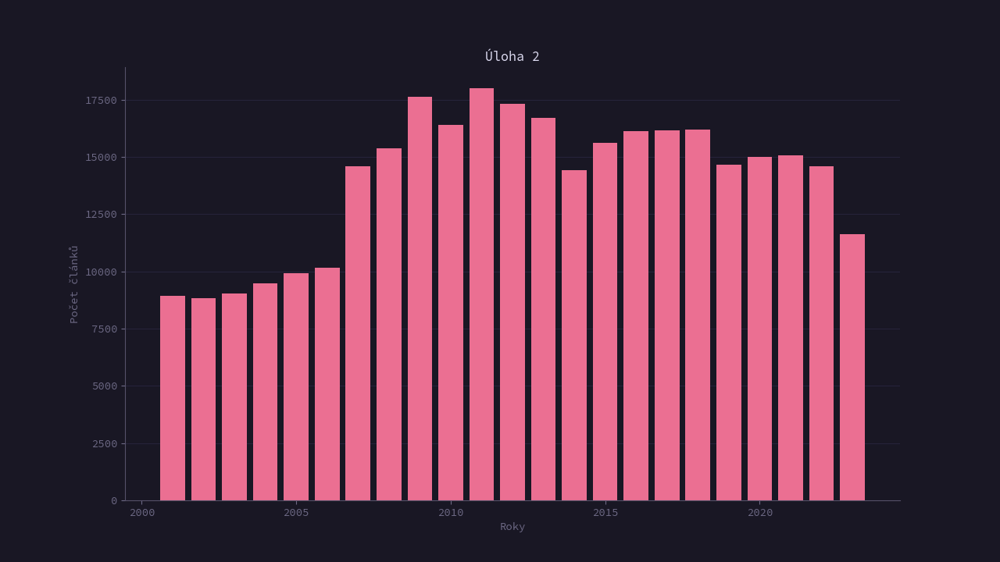
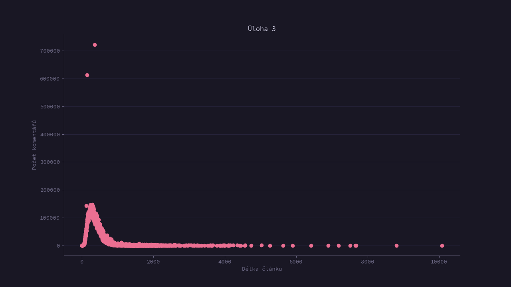
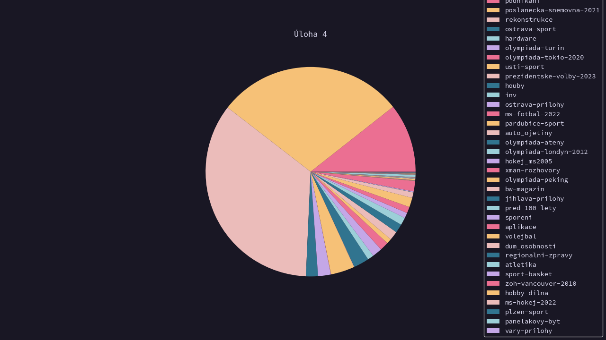
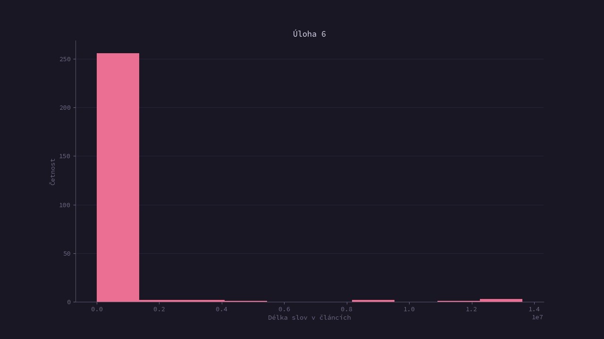
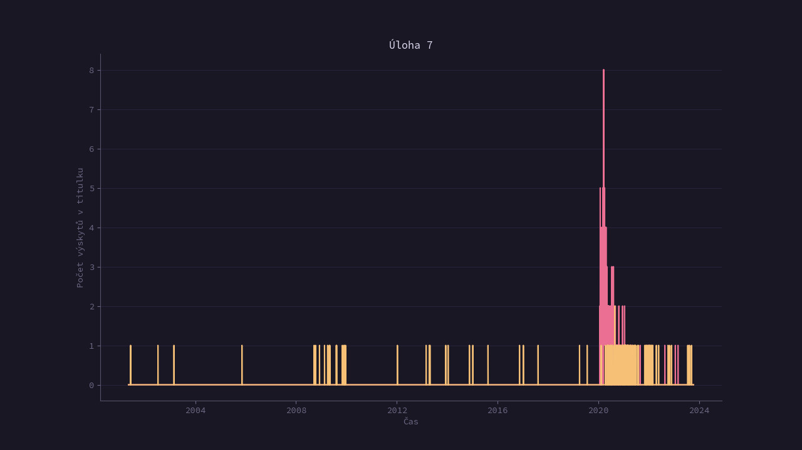
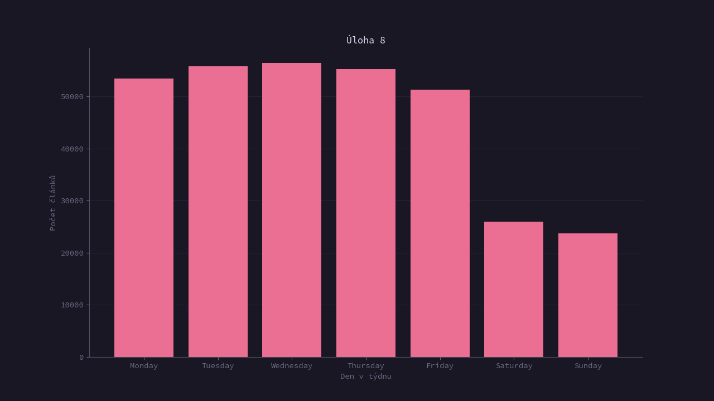

# Cvičení 3

## Základní

### 1. Vykreslete křivku zobrazující přidávání článků v čase



### 2. Vykreslete sloupcový graf zobrazující počet článků v jednotlivých rocích



### 3. Vykreslete scatter graf zobrazující vztah mezi délkou článku a počtem komentářů



### 4. Vykreslete koláčový graf zobrazující podíl článků v jednotlivých kategoriích



### 5. Vykreslete histogram pro počet slov v článcích


### 6. Vykreslete histogram pro délku slov v článcích



### 7. Vykreslete časovou osu zobrazující výskyt slova koronavirus pro počet slov v článcích.

- Přidejte druhou křivku pro výraz vakcína



### 8. Vykreslete histogram pro počet článků v jednotlivých dnech týdne



## Bonus

- Načtěte data do libovolné NoSQL databáze a pomocí dotazů:

### 9. Vypište jeden náhodný článek

```py
query = {
    "function_score": {
        "functions": [
            {
                "random_score": {
                    "seed": int(round(datetime.now().timestamp()))
                }
            }
        ]
    }
}

result = es.search(index=INDEX_NAME, query=query)
```

### 10. Vypiště celkový počet článků

```py
result = es.count(index=INDEX_NAME)["count"]
```

### 11. Vypiště průměrný počet fotek na článek

```py
aggs = {
    "pocet_fotek": {
        "avg": {
            "field": "no_of_photos"
        }
    }
}

result = es.search(index=INDEX_NAME, aggs=aggs)["aggregations"]["pocet_fotek"]["value"]
```

### 12. Vypište počet článků s více než 100 komentáři

```py
aggs = {
    "komentovany": {
        "range": {
            "no_of_commnets": {
                "gt": 100
            }
        }
    }
}

result = es.search(index=INDEX_NAME, aggs=aggs)["aggregations"]["komentovany"]
```

### 13. Pro každou kategorii vypiště počet článků z roku 2022

```py
# Nalezení počtu kategorií pro nastavení limitu
aggs = {
    "pocet_kategorii": {
        "cardinality": {
            "field": "category.keyword"
        }
    }
}

unique_cats_query = es.search(index=INDEX_NAME, aggs=aggs)
no_of_uniq_cats = unique_cats_query["aggregations"]["pocet_kategorii"]["value"]

# Počet článků v jednotlivých kategoriích
aggs = {
    "unikatni_kategorie": {
        "date_range": {
            "field": "date",
            "ranges": [
                {
                "from": "2022-01-01"
                },
                {
                "to": "2022-12-31"
                }
            ]
        }
        "aggs": {
            "pocet_clanku": {
                "terms": {
                    "field": "category.keyword",
                    "size": no_of_uniq_cats
                }
            }
        }
    }
}

categories_aggregation = es.search(index=INDEX_NAME, aggs=aggs)["aggregations"]
```
